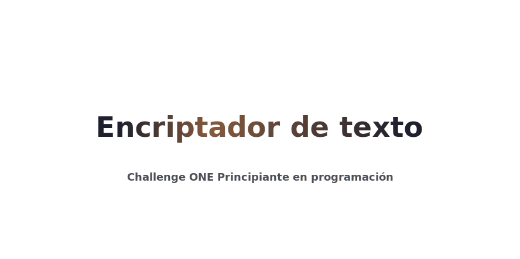

# encriptador

Encriptador de texto creado con JavaScript, HTML y CSS para el Sprint 1 - Challenge ONE Principiante en programación.

Accesible a través del siguiente link:
https://a-gf.github.io/encriptador/